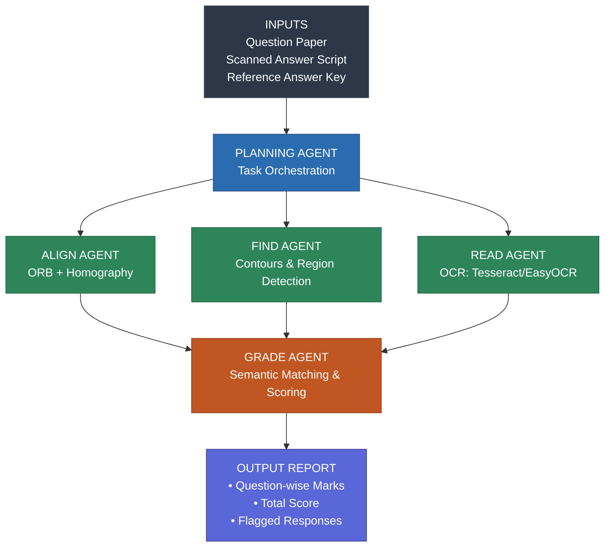

# 🧠 PaperBrain – Automated Handwritten Answer Script Evaluation

## 📘 Overview
**PaperBrain** is an AI-powered system that automates the evaluation of handwritten answer sheets for educational institutions.

Traditional evaluation methods rely on manual checking — which is time-consuming, error-prone, and resource-intensive. Teachers often spend days sorting, grading, and handling physical scripts, leading to delays and inconsistencies in results.

**PaperBrain** solves this by combining *computer vision, OCR, and semantic AI* to perform fair, fast, and scalable evaluations. It automatically aligns scanned copies, reads handwritten answers, maps them to reference solutions, and generates accurate, bias-free grade reports.

---

## 💡 Solution Overview
PaperBrain uses a **multi-agent AI pipeline** designed for high accuracy, modularity, and adaptability. Each agent in the system performs a specific task in the evaluation process:

1. **Planning Agent** – Orchestrates the workflow, coordinating all other agents.  
2. **Agent 1: Align** – Detects distortions and performs automatic alignment of scanned copies using *ORB detection* and *homography transformation*.  
3. **Agent 2: Find** – Identifies regions of interest (answer areas) using *pixel differencing* and *contour detection*.  
4. **Agent 3: Read** – Extracts handwritten text from identified regions using OCR models such as *Tesseract* or *EasyOCR*.  
5. **Agent 4: Grade** – Compares extracted text with reference answers using *semantic similarity* and *context-aware grading*.  
6. **Report Generation** – Produces a digital grade report that includes total marks, individual question scores, and flagged anomalies for manual review when required.

---

## ⚙️ System Architecture

## ⚙️ System Architecture

**Key Capabilities:**  
- ✅ Automatic alignment of distorted answer sheets  
- 🧠 Semantic understanding of handwritten answers  
- ⚠️ Smart anomaly flagging for unclear or incomplete responses  
- 🔁 Works for both **MCQs and descriptive answers**

---

## 👥 Team Members
- Sanjeev Krishna  
- Somasekhara S  
- Bharat K  
- Shivsrijit Verma  
- Gaurav M  

